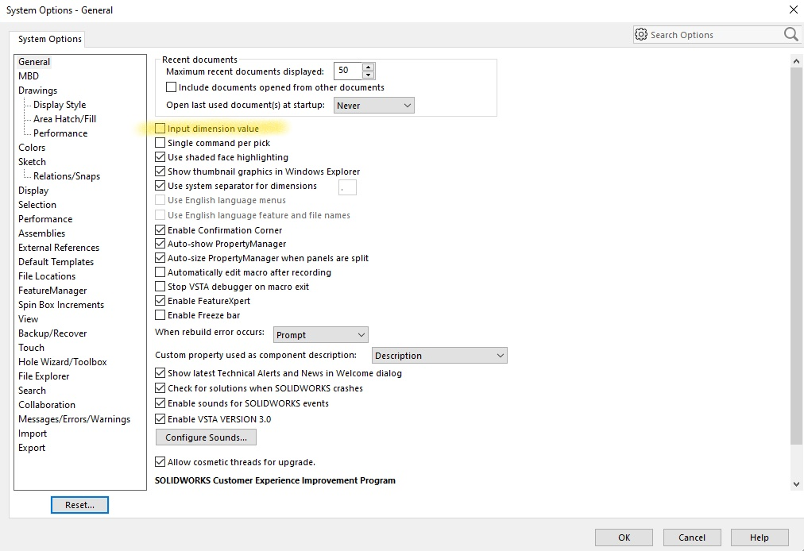

# Welcome to my SolidWorks Tab Builder Project Site

### Project Overview
The main goal of the project was to learn to use the SolidWorks API and to automate the design of tabs. The basic function of the code it to create a tab in Solidworks CAD based on dimensions inputted by the users. The user can then view the part file and continue to modify dimensions until they are ready to save the file. They are able to choose between the following types of tabs and vary the following dimensions:


### Demo  
Below is a video running through an example where a simple tab is built and modified:

<iframe width="700" height="394" src="https://www.youtube-nocookie.com/embed/5ROlcDL_kiw" frameborder="0" allow="accelerometer; autoplay; clipboard-write; encrypted-media; gyroscope; picture-in-picture" allowfullscreen></iframe>

### Installation
In order to run this code you will need access to Solidworks and a coding environment in windows. I used 
[Solidworks 2019](https://www.solidworks.com/sw/support/downloads.htm),
[Anaconda for Windows](https://www.anaconda.com/products/individual), and
[Git for Windows](https://gitforwindows.org/).


An python wrapper called PyWin32 also needs to be installed. It allows you to gain access to the Win32 API and allows you to create and use COM objects. To install use the following: 

```
conda install pywin32
```

### Start-Up
To start you need to open the SolidWorks application manually, so the start of the code has something to dispatch to. Depending on what version of the SolidWorks you have installed, the variable swYearLastDigit may need to be changed. For example, if you have SolidWorks 2013 you would set that variable equal to 3. It is worth noting that for older versions of SolidWorks the SolidWorks API may have changed and I have not tested the code on any older versions. However, it should work perfectly for versions 2019 and 2020.  
```
swYearLastDigit = 9
sw = win32com.client.Dispatch("SldWorks.Application.%d" % (20+(swYearLastDigit-2))) 
```
You also need to make sure the following setting is turned off:


This is a link to my [project’s GitHub page](https://github.com/lindahu123/Solidworks-Macros)

### About Me
Hi, my name is Linda Hu! I am second year student studying Mechanical Engineering at the Olin College of Engineeirng. 

### Helpful References
It will be helpful to understand the basics of the
[Solidworks API Hierarchy](http://help.solidworks.com/2019/english/api/sldworksapiprogguide/GettingStarted/Understanding_the_SolidWorks_API_Class_Hierarchy.htm?id=d523a164296a4b9a8801e61e8225e8a5#Pg0).
There is very extensive documentation on the availible functions in the Solidworks API help site, however only examples with VBA, VB, and C# (the commonly used languages for Solidworks API) are shown. Fortunately, the code that works in python looks very similar to the Visual Basic code that is published and the inputs to the functions are generally standard across all languages. One example is the
[CreateCircle Method](http://help.solidworks.com/2019/english/api/sldworksapi/solidworks.interop.sldworks~solidworks.interop.sldworks.imodeldoc~createcircle.html).
There is a search bar where you can look up other methods. The code does differ for different versions of Solidworks and you can just change the year in the url to look at documentations for all versions. 


I got started by reading
[Joshua Redstone's blog](https://joshuaredstone.blogspot.com/2015/02/solidworks-macros-via-python.html)
which has examples of a couple syntax differences between the visual basic and python code. 


https://lindahu123.github.io/Solidworks-Macros/
