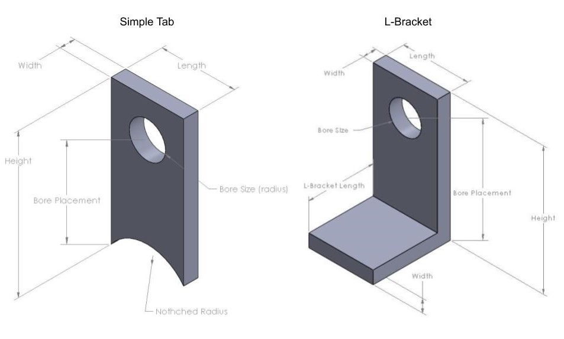

# Welcome to my SolidWorks Project Site

### Project Overview
The main goal of the project was to learn to use the SolidWorks API and to automate the design of tabs. The basic function of the code it to create a tab in Solidworks CAD based on dimensions inputted by the users. The user can then view the part file and continue to modify dimensions until they are ready to save the file. They are able to choose between the following types of tabs and vary the following dimensions:



### Demo
- Screenshots or demos of your project

<div align="center">
  <a href="https://www.youtube.com/watch?v=sFee_wt9bGE&list=RDsFee_wt9bGE&start_radio=1"></a>
</div>

### Installation
- Installation instructions (or link to the relevant portion of the README)
- Download links for your project
- A link to your project’s GitHub page

In order to run this code you will need access to Solidworks and a coding environment in windows. I used 
[Solidworks 2019](https://www.solidworks.com/sw/support/downloads.htm),
[Anaconda for Windows](https://www.anaconda.com/products/individual), and
[Git for Windows](https://gitforwindows.org/).


An python wrapper called PyWin32 also needs to be installed. It allows you to gain access to the Win32 API and allows you to create and use COM objects. To install use the following: 
```
conda install pywin32
```

### About Me
- Information about you (to the extent you are comfortable)

### Helpful References
- Attribution for any external resources you used

It was helpful for me to understand the
[Solidworks API Hierarchy](http://help.solidworks.com/2019/english/api/sldworksapiprogguide/GettingStarted/Understanding_the_SolidWorks_API_Class_Hierarchy.htm?id=d523a164296a4b9a8801e61e8225e8a5#Pg0).
There is very extensive documentation of the Solidworks API help site. There is no information on coding in python, however the code looks very similar to the Visual Basic code that is published and the inputs to the functions are generally standard across all languages. One example is the
[CreateCircle Method](http://help.solidworks.com/2019/english/api/sldworksapi/solidworks.interop.sldworks~solidworks.interop.sldworks.imodeldoc~createcircle.html).
There is a search bar where you can look up other methods. The code does differ for different versions of Solidworks and you can just change the year in the url to look at documentations for all versions. 


I got started by reading
[Joshua Redstone's blog](https://joshuaredstone.blogspot.com/2015/02/solidworks-macros-via-python.html)
which has examples of a couple syntax differences between vb code and python code. 


### Support or Contact

Having trouble with Pages? Check out our [documentation](https://docs.github.com/categories/github-pages-basics/) or [contact support](https://github.com/contact) and we’ll help you sort it out.
